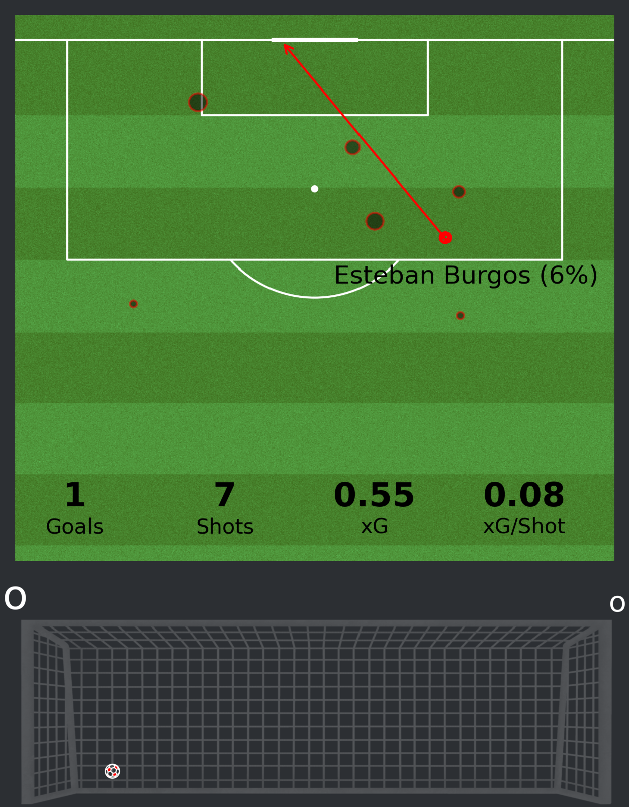
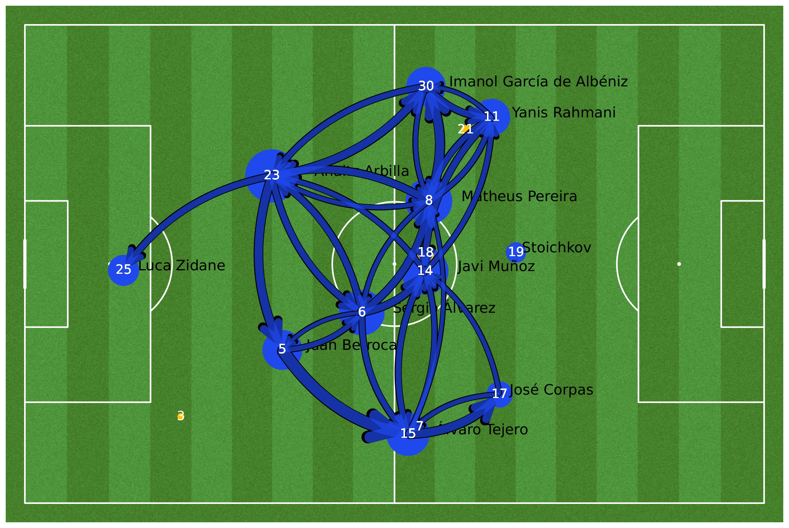
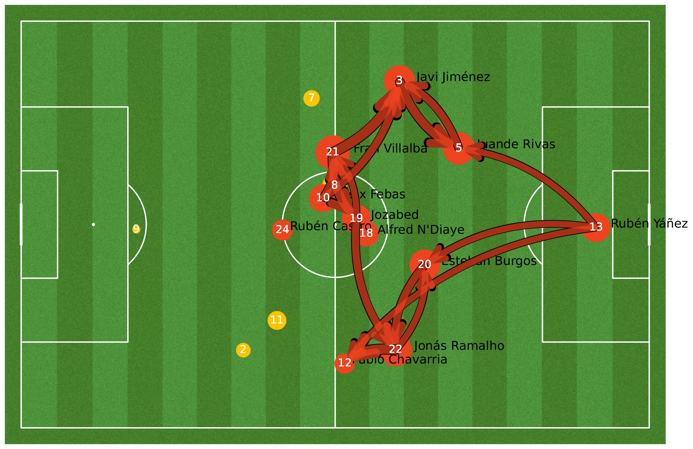

# Data Analytics in football
Looking at an xG evolution figure, such as Fig. \@ref(fig:xg), and solely focusing on shot probabilities while disregarding the spatial distribution of shots and occasions feels like merely scratching the surface of what sport analytics can offer to football.

To illustrate the spatial distribution of shot locations taken by both teams during the game, we can create a shot map for each shot. In Fig. \@ref(fig:shotmap), the size of each data point corresponds to the expected goals (xG) generated for the respective shots, providing insights into the perceived scoring potential. Goals scored are visually highlighted with straight lines, indicating the trajectory the ball followed as it found its way into the opponent's net. Bellow each shot map, a plot of the net can be also found, where goals are represented by football balls, and blocked shots by shadowed points. This detailed analysis not only enhances our understanding of scoring opportunities but also sheds light on the tactical strategies employed by both teams, player positioning, and defensive vulnerabilities. Analyses such as the one above are carried out using the most common
source of data in football: **Events** datasets.

```{r shotmap, fig.show="hold", out.width = "45%", fig.align = "center", fig.cap= "Shot map of the Eibar (blue, left) - Malaga (red, right) football match. The locations of the points indicate where shots were taken. The size of each point is proportional to the expected goals (xG) generated. Shots that resulted in goals are depicted with a straight line, representing the path the ball took to enter the opponent’s net.",echo = FALSE}

knitr::include_graphics("imagenes/home_shot_map.png")

```

## Events data
`Event data`  describes specific, human-defined events during a match,
including passes, shots, and fouls. It is captured by human annotators
from various providers. However, this manual process is time-consuming
and typically requires three individuals:

The data collection process is carried out by professional video
analysts (known as operators), who are specialists in football data
collection, using proprietary software (the tagger). The tagger has
undergone several years of development and improvement and is regularly
updated to ensure the highest level of performance is achieved. To
ensure accurate data collection when tagging events in soccer matches,
three operators are assigned: one per team and one supervising the
output of the entire match. This process is based on analysis of the
tagger and soccer match videos. When near-live data delivery is
necessary, a team of four operators may be utilized, with one operator
dedicated to hastening the collection of complex events that require
additional, specific attributes or a quick review [@3].

This type of data structure can be used in a number of ways: it can be
used to measure team performance through general statistics extracted
from event datasets, such as goals, fouls, xG, etc. It can also be used
to create advanced analysis of the team using ensembles of mathematical
tools.

The analysis of the match is furthered through the use of graph theory,
[@Buldu], [@NOVILLO2024114355]. Combining
different elements of the events dataset, we can create a graph
corresponding to the passing network of each team, allowing us to
understand the passing structure of both teams.


Figs. \@ref(fig:homepass) and \@ref(fig:awaypass) illustrate the
passing networks observed in the Eibar versus Málaga football match,
providing insight into the passing interactions and tactical strategies
used by both teams. The nodes in the graphs represent individual players
who participated in the match for each team. The nodes are sized
according to their degree, which represents the amount of ingoing and
outgoing passes. The node position corresponds to the average passing
position of each player. Substitutes are represented by yellow nodes,
and links are created if there have been at least 5 passes made in that
direction between two players. The edge's width corresponds to the
amount of passes made in that direction between the two players.

```{r homepass, out.width='80%', fig.align='center', fig.cap= "Representation of the Eibar passing networks of the match Eibar - Málaga. Nodes represent players, edges represent passes between players. The position of the players in the field is their average passing position. The size of the nodes reflects the number of ingoing and outgoing passes (i.e. node’s degree), while the size of the edges is proportional to the number of passes between the players. Substitutes are represented in yellow. A connection is set if those players share at least 5 passes. The edge’s width is proportional to the amount of passes made in that direction between the two players.",echo = FALSE}

```

```{r awaypass, out.width='80%', fig.align='center', fig.cap= "Representation of the Málaga passing networks of the match Eibar - Málaga. Nodes represent players, edges represent passes between players. The position of the players in the field is their average passing position. The size of the nodes reflects the number of ingoing and outgoing passes (i.e. node’s degree), while the size of the edges is proportional to the number of passes between the players. Substitutes are represented in yellow. A connection is set if those players share at least 5 passes. The edge’s width is proportional to the amount of passes made in that direction between the two players.",echo = FALSE}

```

Analysis as the former can be conducted *in real-time*[^1] during the
match using appropriate data sources. Additionally, we could examine
Eibar's macro situation during the 2022-2023 season to better comprehend
how this micro-statistics contribute to the overall perception of the
team.

[^1]: Opta uses a combination of human annotation, computer vision, and
    AI modelling to offer real-time data at various levels of detail
    based on customer requirements. In our situation, the data feed
    updates itself when an event such as a goal, foul or pass occurs;
    otherwise, it updates every 90 seconds. [@opta]
