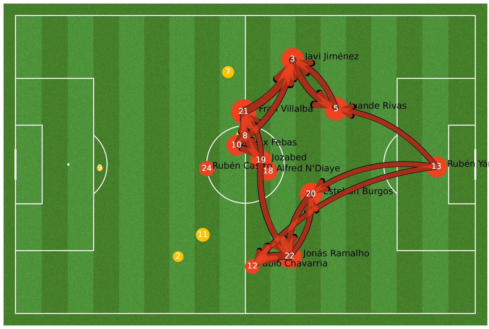

# Data Analytics in football
When discussing sports analytics in football, the first metric that
often comes to mind is the *Expected Goals (xG) ratio*. This statistical indicator is a predictive Machine Learning (ML) model used to assess the likelihood of scoring for every shot made in the game. In the context of each shot, most Expected Goals models consider the following factors: distance to goal, angle to goal, body part used for the shot, and type of assist or previous action (such as throughball, cross, set-piece, or dribble). Then, using a regression model, the xG model assigns a value between 0 and 1 to each shot, indicating the probability of it resulting in a goal.

Wyscout xG model, for example, encompass the shot's spatial coordinates, the assisting player's position, the striking player's use of foot or head, the type of assist involved, the occurrence of a dribble by either a field player or the goalkeeper immediately preceding the shot, whether the shot arises from a set piece, whether it transpires during a counterattack or in a transitional phase of play, and the subjective assessment of shot danger as determined by a designated tagger. This set of parameters serves as the foundation for training the xG model using historical Wyscout data, culminating in the prediction of the likelihood of a given shot resulting in a goal [@wyscout].

Since the probabilities range from 0 to 1, a shot with an xG value of
0.1 has a 10% chance of being scored. Penalties have a fixed xG value of 0.76.

Fig. \@ref(fig:xg)  provides a visual representation of the cumulative development of expected goals
(xG) during the Eibar - Malaga match, which took place on January 15th, 2023 in Spain's second division. Each data point on the graph
corresponds to a shot made by both teams during the game,
offering a comprehensive overview of the evolving scoring opportunities and outcomes throughout the duration of the game.

```{r xg, out.width='80%', fig.align='center', fig.cap= "Cumulative development of expected goals (xG) during the Eibar-Malaga match, held on January 15th in Spain’s second division. Each point denotes a shot made by both teams throughout the game. Vertical dashed lines indicate the goal scored, displaying the player and the corresponding score at that specific moment of the match.",echo = FALSE}
knitr::include_graphics("imagenes/xg_evol.png")
```


Expected Goals (xG) have revolutionized the analysis of football by quantifying the quality of scoring opportunities. However, it is important to consider other variables such as player positioning, velocity, passing accuracy, defensive pressure, and tactical formations to gain a broader understanding of the sport. Using the game presented earlier as an example, the next chapter will introduce the broad field of football analytics.

Looking at an xG evolution figure, such as Fig. \@ref(fig:xg), and solely focusing on shot probabilities while disregarding the spatial distribution of shots and occasions feels like merely scratching the surface of what sport analytics can offer to football.

To illustrate the spatial distribution of shot locations taken by both teams during the game, we can create a shot map for each shot. In Fig. \@ref(fig:shotmap), the size of each data point corresponds to the expected goals (xG) generated for the respective shots, providing insights into the perceived scoring potential. Goals scored are visually highlighted with straight lines, indicating the trajectory the ball followed as it found its way into the opponent's net. Bellow each shot map, a plot of the net can be also found, where goals are represented by football balls, and blocked shots by shadowed points. This detailed analysis not only enhances our understanding of scoring opportunities but also sheds light on the tactical strategies employed by both teams, player positioning, and defensive vulnerabilities. Analyses such as the one above are carried out using the most common
source of data in football: **Events** datasets.

```{r shotmap, fig.show="hold", out.width = "45%", fig.align = "center", fig.cap= "Shot map of the Eibar (blue, left) - Malaga (red, right) football match. The locations of the points indicate where shots were taken. The size of each point is proportional to the expected goals (xG) generated. Shots that resulted in goals are depicted with a straight line, representing the path the ball took to enter the opponent’s net.",echo = FALSE}

knitr::include_graphics("imagenes/home_shot_map.png")
knitr::include_graphics("imagenes/away_shot_map.png")
```

## Events data
`Event data`  describes specific, human-defined events during a match,
including passes, shots, and fouls. It is captured by human annotators
from various providers. However, this manual process is time-consuming
and typically requires three individuals:

The data collection process is carried out by professional video
analysts (known as operators), who are specialists in football data
collection, using proprietary software (the tagger)[^3]. The tagger has
undergone several years of development and improvement and is regularly
updated to ensure the highest level of performance is achieved. To
ensure accurate data collection when tagging events in soccer matches,
three operators are assigned: one per team and one supervising the
output of the entire match. This process is based on analysis of the
tagger and soccer match videos. When near-live data delivery is
necessary, a team of four operators may be utilized, with one operator
dedicated to hastening the collection of complex events that require
additional, specific attributes or a quick review [@3].

```{r event,echo = FALSE}
library("kableExtra")
library("tidyr")
data <-read.table("data_samples/1074816_key_event.txt", header = T) 

head(data) %>%
  kbl(booktabs = T, caption = "Example of an events dataset of a game.") %>%
  kable_styling(latex_options = c("scale_down","hold_position"), position = "center")
```


This type of data structure can be used in a number of ways: it can be
used to measure team performance through general statistics extracted
from event datasets, such as goals, fouls, xG, etc. It can also be used to create advanced analysis of the team using ensembles of mathematical models.

The match analysis is frequently conducted using Graph Theory, [@Buldu], [@NOVILLO2024114355]. Combining
different elements of the events dataset, we can create a graph
corresponding to the passing network of each team, allowing us to
understand the passing structure of both teams.


Figs. \@ref(fig:homepass) illustrate the
passing networks observed in the Eibar versus Málaga football match,
providing insight into the passing interactions and tactical strategies
used by both teams. The nodes in the graphs represent individual players
who participated in the match for each team. The nodes are sized
according to their degree, which represents the amount of ingoing and
outgoing passes. The node position corresponds to the average passing
position of each player. Substitute players are represented by yellow nodes,
and links are created if there have been at least 5 passes made in that
direction between two players. The edge's width corresponds to the
amount of passes made in that direction between the two players.

```{r homepass, fig.show="hold",out.width='50%', fig.align='center', fig.cap= "Representation of the Eibar (blue, left), Málaga (right, red) passing networks of the match Eibar - Málaga. Nodes represent players, edges represent passes between players. The position of the players in the field is their average passing position. The size of the nodes reflects the number of ingoing and outgoing passes (i.e. node’s degree), while the size of the edges is proportional to the number of passes between the players. Substitute players are represented in yellow. A connection is set if those players share at least 5 passes. The edge’s width is proportional to the amount of passes made in that direction between the two players.",echo = FALSE}
knitr::include_graphics("imagenes/home_pass_network.jpg")

```

Analysis as the former can be conducted *in real-time*[^2] during the
match using appropriate data sources. Additionally, we could examine
Eibar's macro situation during the 2022-2023 season to better comprehend
how this micro-statistics contribute to the overall perception of the
team.

Fig. \@ref(fig:xg-xga) presents the expected goals (xG) produced by Eibar in all matches played against their opponents. It is noticeable that Eibar has generated a higher xG when playing at their Home stadium, on average.


```{r xg-xga, out.width='80%', fig.align='center', fig.cap= "Expected Goals (xG) and Expected Goals Against (xGA) per match. Codes: Home Matches (Diamonds), Away Matches (Circles), Wins (Green), Draws (Blue), Losses (Red). Matches above the dashed lines represent those matches where Eibar has generated more xG than the opponent.",echo = FALSE}
knitr::include_graphics("imagenes/scat-xG-xGa.png")
```


We have discussed some of the statistics that can be inferred from this data source to characterize team performance, such as possession, pressure, duels, and fouls. These datasets are easily manageable and provide teams with useful information. However, due to limitations in space and scope, we cannot provide a more in-depth analysis of these measures.

Although event datasets supply beneficial information regarding the team's overall performance, deeper scrutiny can be conducted via tracking data, which consists of the players' and ball's position and movement during the match. Tracking data can offer additional insight into both the physical and tactical aspects of the game. 

## Tracking data

`Tracking data` offers a more comprehensive perspective than event data by providing access to information on all players, their trajectories, and velocities. This allows for the analysis of off-ball players and team dynamics, resulting in a more nuanced understanding of the game.

There are two main techniques for obtaining tracking data, which decide its classification: **Image detection algorithms** extract players' positions from the match broadcast and infer locations of players that are not visible in the broadcast frame, whereas **optical tracking** employs a specialized camera system installed on the field to record players' data. Our research will concentrate on the latter method, as it offers more precise and statistically informative data.

Our tracking data has been provided by Mediacoach®. They utilises the Tracab Optical Tracking system to obtain on-the-pitch player positions. This multi-camera system captures each player's position at 25 frames per second. The system consists of three units, each with a resolution of 1920x1080 pixels, producing a panoramic picture that generates a stereoscopic view for triangulating the players and ball. In case of a temporary loss of any location, a skilled operator adjusts the players' positions. The datasets obtained by the Mediacoach® system have been validated in advance using GPS [@Felipe2019ValidationOA].

Fig. \@ref(fig:frame) contains a frame from the tracking dataset of an Atlético de Madrid (Blue) - Getafe (Red) game from the Spanish 2019 League. The ball is shown as a black dot. Referees are shown as yellow squares. Purple arrows represent the speed vectors of the players. 

```{r frame, out.width='80%', fig.align='center', fig.cap= "A frame of tracking data from a football match. The home team is shown in blue, the away team in red. The ball is shown as a black dot. Referees are shown as yellow squares. Purple arrows represent the speed vectors of the players.",echo = FALSE}
knitr::include_graphics("imagenes/Frame.png")
```

Traditionally, all football statistics have been produced using event datasets. In this respect, tracking datasets have been crucial in developing new ways of measuring team and player performance. With this type of information, we are not just limited to ball-related events such as passes, goals, etc. tracking datasets contain the precise location of players and the ball during a match. [@GARRIDO2022112827] showed that the correlation between heatmaps, Fig. \@ref(fig:heatmap), made with event datasets and those made with tracking datasets is low. Event heatmaps show where a player has performed more actions. On the other hand, tracking heatmaps provide information about a player's position without adding information about how relevant his about how relevant their performance was. 

```{r heatmap, out.width='80%', fig.align='center', fig.cap= "Heatmap of the ball position during the Atlético de Madrid - Getafe game under study. Note that we always keep the direction of play from left to right, so the home team will always be placed on the left side of the field and the away team on the right.",echo = FALSE}
knitr::include_graphics("imagenes/Heatmap.jpg")
```

Thus, tracking datasets are crucial for developing new ways of measuring team and player performance, as they provide us with global information about the game. 

This data-driven approach enhances the understanding of the sport and its strategic nuances, fostering a deeper appreciation of the game's intricacies. As a result, tracking data has become a valuable tool in football analysis, providing insights into player performance and team strategy. It can be applied to specific games, as in the analysis presented earlier (Fig. \@ref(fig:heatmap)), or to an ensemble of them to provide a comprehensive view of general player behavior under different physical and tactical metrics, constructed using tracking datasets.

In the next chapter, after the initial review of the state of art of football analytics, we will combine both physical metrics and tactical models derived from Tracking datasets to build our proposed metric to characterize offside strategy's effectiveness: *Offside Control*

[^2]: Opta [@opta] uses a combination of human annotation, computer vision, and AI modelling to offer real-time data at various levels of detail based on customer requirements. In our situation, the data feed updates itself when an event such as a goal, foul or pass occurs. Otherwise, it updates every 90 seconds. 
    
[^3]: See Fig. 1 in [@3] for an example of the tagging software
