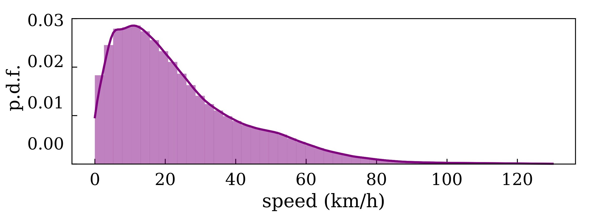
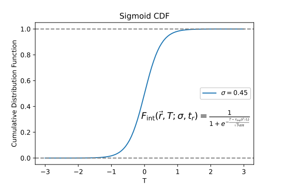

# Methodology

As discussed earlier, tracking datasets provide the position of all players and the ball throughout the match with a temporal resolution of 25fps. This enables us to estimate the players' covered distance, speed, and acceleration. The potential for extracting information from tracking datasets that is useful for football analytics extends beyond variables related to players' physical performance. Many tactical metrics has been implemented to decode how the intricate movements of players translate to the soccer field.

These models provide a scientific perspective for analysing player positioning, decision-
making, and team dynamics, illuminating the complex interactions that occur during a
match.

*Pitch Control* is one of the most relevant tactical metrics used to analyse player positioning, decision-making, and team dynamics during a soccer match. It combines player position and speed with mathematical models that simulate ball and player movement [@Spearman].

This master's thesis proposes using Pitch Control Models to evaluate how football teams interact with the offside line when attacking and defending. Before that, we need first to define and understand Pitch Control Models, including their construction and implementation. 

## Pitch Control Models

The *Pitch Control (PC)* at a given location represents the probability of a player or team gaining control of the ball if it moves directly to that location. *PC* models simulate the dynamics of the ball and the players to evaluate which player would control the ball if it moves to any location on the pitch at any moment. 
The model captures not only the players' current position, but also their movement. When players are running at high speeds, they are more likely to control
the space they are moving into rather than the space they currently occupy.

To construct this model, we must calculate the following for a given location on the pitch:

- How long it would take for the ball to reach to the position of interest (from its starting position).
- How long would it take for each player to get to that position.
- What is the total *probability* that each team will control the ball *after* both the players and the ball have arrived at the desired position?


In the model, the ball is set to move at a constant speed of $v_b = 54$ $km/h$, which is approximately the average speed of the ball in the game (See Fig. \@ref(fig:ball))

```{r ball, out.width='80%', fig.align='center', fig.cap= "p.d.f of the ball speed over a 100 matches from LaLiga 2019-2020 season.",echo = FALSE}

```

Therefore, the time taken to arrive at the location of interest can be easily calculated as $t_{b,arr} = \Delta x_b/v_b$, where $\Delta x_b$ is the distance between the initial and final positions of the ball.

When considering how long it will take the players to reach the target position, given their initial position and speed, players are assumed to only have a maximum speed of $v_{max,p} = 18$ $km/h$, which corresponds to the 95 percentile of the average speed of the players in the game (See Fig. \@ref(fig:vel)). This upper limit should not be misunderstood as the maximum speed at which players can move, but rather as an estimate of the maximum speed at which they are likely to move when trying to control the ball 

```{r vel, out.width='80%', fig.align='center', fig.cap= "p.d.f of the players speed over a 100 matches from LaLiga 2019-2020 season.",echo = FALSE}
knitr::include_graphics("imagenes/vel.png")
```

To compute the player's expected arrival time, $\tau_{exp}(\vec{r};t_r)$ , we use a simple approximation consisting of a two-step process:

- There is an initial *reaction time*, assumed to be of \( t_{r} = 0.7 \) seconds for every player[^3]. This is approximately the time it takes a player moving at maximum speed to come to a complete stop. During this reaction time, we assume that players continue to move along their current trajectory without changing speed or direction (reaching a position \( \vec{r}_{\text{react}} \)).
- After this time, we assume that the player runs directly towards the ball at his maximum speed of \( v_{\text{max,p}} \).

\begin{align}
    \tau_{exp}(\vec{r} ; t_r) = t_r + \frac{|\vec{r} - \vec{r}_{react}|}{v_{max,p}}
    \label{exp_arr_time}
\end{align}

Once we computed the time it takes for the ball and the players to get to the target location, we need to look at how long it will take each player to control the ball. To do so, we will assume that controlling the ball is a stochastic process that follows an exponential distribution with a fixed rate $\lambda$, with units of $1/s$. Thus, for any differential time $\Delta t$ that a player is near the ball, he has a probability of $\lambda \cdot \Delta t$ of controlling the ball.

\begin{align}
F(\Delta t ; \lambda)=1-e^{-\lambda \Delta t}
\end{align}

So far, the model assumes that we know exactly when each player will arrive at the target location. However, we introduce some uncertainty, labelled $\sigma$, in the arrival time of the players. The reason for including such temporal variability in our model is to account for some effects that have not been explicitly modeled, such as player effort. Thus, the probability of a player intercepting the ball at time T is given by the cumulative distribution function of the sigmoid distribution (See Fig. \@ref(fig:lambda)).

\begin{align}
    F_{\text {int }}(\vec{r},T;\sigma, t_r)=\frac{1}{1+e^{-\frac{T- \tau_{exp}(\vec{r} ; t_r)}{\sqrt{3} \sigma / \pi}}}
    \label{sigmoid}
\end{align}


```{r lambda, fig.show="hold", out.width='45%', fig.align='center', fig.cap= "Cumulative distribution function of the time to control the ball.",echo = FALSE}
knitr::include_graphics("imagenes/exp_poster.png")

```

Both $\lambda$ and $\sigma$ has been selected according to [@SpearmanFit], where they model passes as a Bernoulli	trial, with probability	mass function

\begin{align}
P(k \mid \sigma, \lambda, x)=\left\{\begin{array}{lr}
1-p \text { for } \mathrm{k}=0 \\
p & \text { for } \mathrm{k}=1
\end{array}\right.
\end{align}

where $k \in [0,1]$ is the outcome of the pass. Then, the	likelihood	of	a	set	of	
parameters,	$\sigma$ and $\lambda$, given outcome	$k$ and	the start of the pass $x$ is:

\begin{align}
\mathcal{L}(\sigma, \lambda \mid k, x)=P(k \mid \sigma, \lambda, x)
\end{align}

Then,	maximizing	the	product	of	the	likelihood	for	each	pass for a training sample P, the best fit is found at $\sigma=0.45 \pm 0.05 \mathrm{~s} \text { and } \lambda=4.30 \pm 1.14 \mathrm{~s}^{-1}$[^4]

\begin{align}
\min _{\sigma, \lambda \in\{\mathbb{R}, \mathbb{R}\}}\left\{-\sum_{i \in P} \log \left[\mathcal{L}\left(\sigma, \lambda \mid k_i, x_i\right)\right]\right\}
\end{align}


[^3]: We can impose this assumption for all the players without loss of generality, to simplify the model. Further work to improve the model will be individualize this reaction parameter for each player.

[^4]: See [@SpearmanFit] for further details