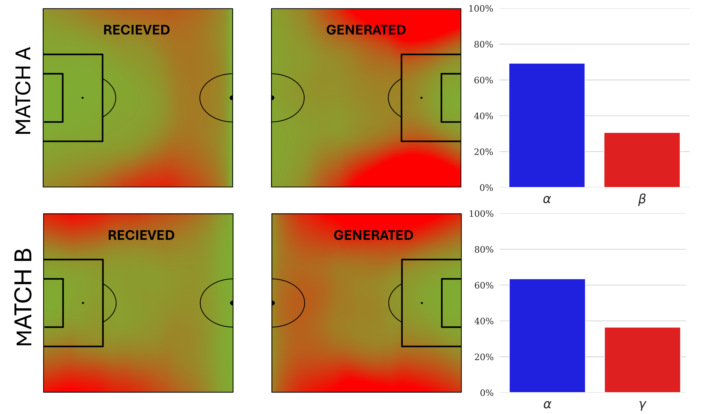
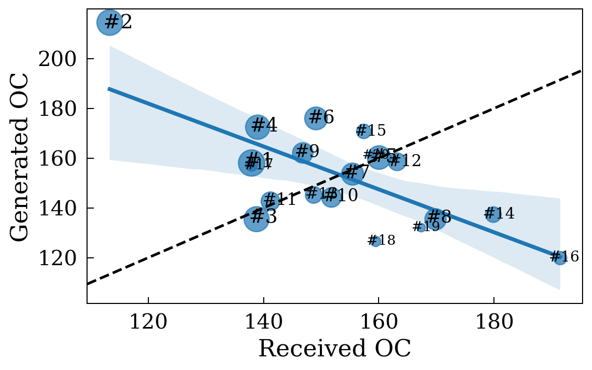
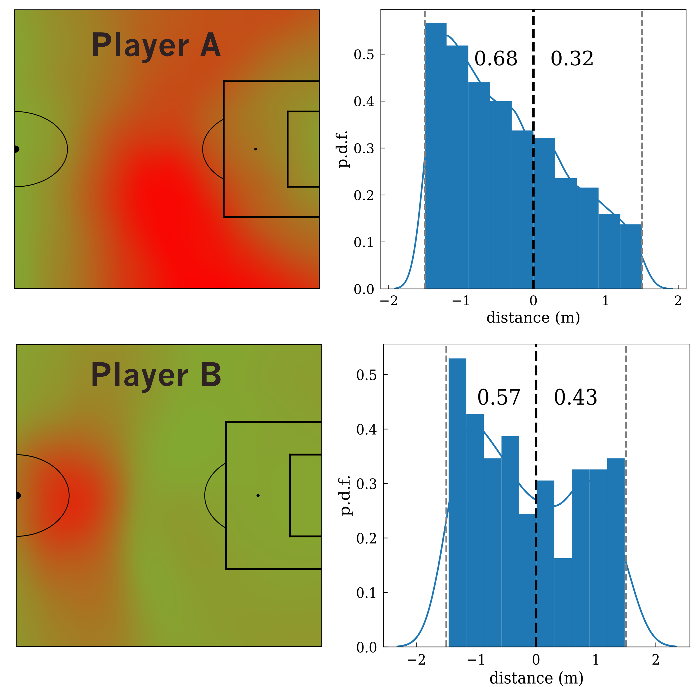

# Reuslts

The procedure for constructing the *Offside Control (OC)* parameter involves first identifying the offside line, which is determined by the position of the second-last defender. Then we identify the attacking players who are within the allowed boundaries and in an offside position in each frame. Once properly identified, we compute the OC metric as a measure of the field control exerted by the attacking team or player after the offside demarcation. Additionally, depending on each player's position with respect to the offside line, we can evaluate a player's involvement in an offside position as a manifestation of ineffective offside control (IOC). Conversely, instances where a player is positioned beyond the offside line and maintains control of the ball are classified as effective offside control (EOC).

The concept of effective and ineffective Offside Control is illustrated in Fig. \@ref(fig:eff). Players from both teams are shown in blue (home team, attacking from left to right) and red (away team, attacking from right to left). Areas of the pitch controlled by the home team are shown in blue, while areas controlled by the away team in that particular match are shown in red. In this frame, the home team is in possession of the ball. The vertical dashed line indicates the position of the offside line. The areas surrounded by a broad grey line represent the areas controlled by the attacking team behind the offside line. We can see that the home player with the number $11$ is behind the offside line, in an invalid position, and therefore generates IOC around him. On the contrary, player $18$ is in a correct position and the Offside Control generated behind the offside line is classified as effective (EOC).

The *Spatial Offside Control* generated by a team can be obtained by simply summing the Offside Control of each team during the match in each region of the pitch behind the offside line. We can also define the *Percentage of Offside Control* accumulated by each team and obtain an indicator of which team gained more control over the opponent. Fig. \@ref(fig:games) shows two examples of both spatial OC and percentage of OC for two different games (A and B) by a team called $\alpha$. We have used a heatmap to show in red the spatial OC generated and received by team $\alpha$, indicating which specific areas of the pitch were controlled behind the offside line. Note that only effective Offside Control is shown in this example. We can see that in match $A$ the danger generated behind the offside line is deeper and closer to the box, while the EOC received is not as close to the own goal. On the other hand, in game $B$, the EOC generated is more longitudinal and closer to the edge of the pitch, while the EOC generated by the opposing team is much deeper and therefore more dangerous. Beyond the spatial location, the bars on the right side of the figure \@ref(fig:games) show the proportion of EOC accumulated by team $\alpha$ and its opponents in both games. In both cases, team $\alpha$ dominates the opposing team, accumulating a percentage higher than $65\%$. 

```{r eff, out.width='80%', fig.align='center', fig.cap= "Example of effective (EOC) and ineffective (IOC) Offside Control (areas surrounded by a thick grey line). Offside is indicated by the vertical dashed line. Note that player $11$ is offside (generating IOC), while player $18$ is not (generating EOC).",echo = FALSE}
knitr::include_graphics("imagenes/eff_inef_OC.png")
```

```{r games, out.width='80%', fig.align='center', fig.cap= "Spatial and percentage of effective offside control (EOC) over the course of two matches (A and B). The left plots show the EOC received by team $\\alpha$ and the middle plots show the EOC generated by team $\\alpha$. In all plots, the intensity of the red color is proportional to the accumulated EOC at each location on the field. The bars on the right show the percentage of EOC accumulated by team $\\alpha$ and its opponents.", echo = FALSE}


```

Offside Control can also be tracked over the course of a match. Fig. \@ref(fig:oct)  shows an example of $OC(t)$ for the home team of a match, smoothed with a centred sliding window of 600 frames. In the figure we have also included the moments when goals were scored. This allows us to relate the $OC(t)$ to the score. As we have plotted the home team's $OC(t)$, we can see that it increases until a few minutes before the third goal is scored. However, it drops around minute 50, which shows that the home team is creating less danger behind the opponent's offside line, presumably trying to defend the goal advantage rather than create new scoring opportunities.

```{r oct, out.width='80%', fig.align='center', fig.cap= "Analysis of the home team's Offside Control over the course of a match. Each point of $OC(t)$ is calculated using a centred sliding window of 600 frames. The vertical dashed lines indicate the moments when a goal was scored (blue for the home team and red for the away team).",echo = FALSE}
knitr::include_graphics("imagenes/cumulative_OC_evolution.png")
```

After analysing the OC of the 99 games evaluated in the study, we can also analyse the OC performance of all teams in the competition. Fig. \@ref(fig:ranking) shows a comparison between the generated and received OC per effective time unit, for all teams. In the figure, the size of the teams and their labels indicate the final ranking after the matches included in the analysis. The dashed line plotted ($y=x$) separates the teams with positive and negative differences between the generated and received OC. Thus, teams below the dashed line generate less OC than their rivals, while teams above it accumulate more OC than their opponents. We can also observe a slight negative correlation between the OC generated and the OC received, although the correlation coefficient $R^2=0.48$ is relatively low. Note that the team in second place generates more OC and receives less. In addition, the teams at the top of the ranking are above the dashed line, with the exception of the team in third place. For a better understanding of the figure, Table \@ref(tab:ranking-tab) of the Appendix contains the Effective OC generated for each team, and the efficiency generating Offside Control, in descending order in ranking

One of the advantages of our proposed metric is its versatility: it can be used to describe the general behavior of the team, as presented above, but it can also be more specific and focus on the performance of specific players. Fig. \@ref(fig:forwards) shows the Effective Offside Control produced by two different strikers, identified as $A$ and $B$. The left panel shows the positions on the pitch where the EOC is produced by each striker. The EOC is normalized by the total time played over the matches analyzed. In this way, we have a heat map showing where a striker tends to create controlled areas behind the offside line, which is useful information for analyzing his performance. In addition, the right panel shows the corresponding probability distribution functions of the time spent by both players at a given distance from the offside line. The distances are referenced to the offside line and are negative when the striker is in a valid position and positive when he is offside. Interestingly, striker $A$ spends more time in front of the offside line than striker $B$ (see the percentages of time spent on each side of the offside line). This means that player $A$ is more likely to generate more EOCs.

```{r ranking, out.width='80%', fig.align='center', fig.cap= "Generated vs. received Offside Control. The values correspond to the average accumulated OC per effective time unit. The size of the nodes (and their labels) correlates with the ranking corresponding to all the matches analysed. The dashed line corresponds to $y=x$. The linear regression is shown in blue and has the equation $y = -0.86x + 285.42$, with $R^2 = 0.48$ and $RMSE = 14.96$. Teams above the dashed line have accumulated more Offside Controls than their rivals.",echo = FALSE}

```

```{r forwards, out.width='70%', fig.align='center', fig.cap= "Effective Offside Control (EOC) of two different strikers, A (upper plots) and B (lower plots). On the left, the positions on the pitch where the two players generate EOC. On the right, the probability distribution function of the time spent at a distance from the offside line. Negative values indicate that the player is in the correct position, while positive values indicate that the player is offside. The EOC is normalised to the time played. The values on the right plot indicate the proportion of time a player is in front of or behind the offside line.",echo = FALSE}

```

In this work, the Offside Control of a total of 442 players was characterized. With all this data, we calculated the percentage of time that strikers spend close to the offside line and what percentage of that time the striker is in a valid position. We call this percentage a player's Offside Time Efficiency Ratio (OTER).  Next, we relate the OTER to the percentage of OC that is effective, i.e. $EOC/IOC$, and we call this percentage the *Offside Control Efficiency Ratio (OCER)*. In Fig. \@ref(fig:forwardsglob) (A) we show the relationship between OTER and OCER for the $50$[^8] forwards. We have obtained a positive correlation between the two metrics, as indicated by the solid blue line. This suggests that the more time a striker spends in a valid position near the offside line, the higher the probability of generating effective Offside Control. 
However, the correlation coefficient between the two variables is low ($R^2=0.2325$), indicating that their relationship is complex and suggesting the effects of alternative variables not considered in our analysis. Finally, Fig. \@ref(fig:forwardsglob) (B) shows the probability distribution function of the values of the OCER. We can see that most of the Offside Control generated by the strikers is effective, indicated by a probability distribution mainly above $0.5$ and a mean of $\langle OTER \rangle=0.7506$.

```{r forwardsglob, out.width='80%', fig.align='center', fig.cap= "Interplay between Offside Time Efficiency Ratio (OTER) and Offside Control Efficiency Ratio (OCER). On the right, we show the OCER vs. OTER of the strikers.",echo = FALSE}
knitr::include_graphics("imagenes/av_eff.png")
```


[^8]: To ensure the statistical validity of the results, the study only included players who played at least 6 games.